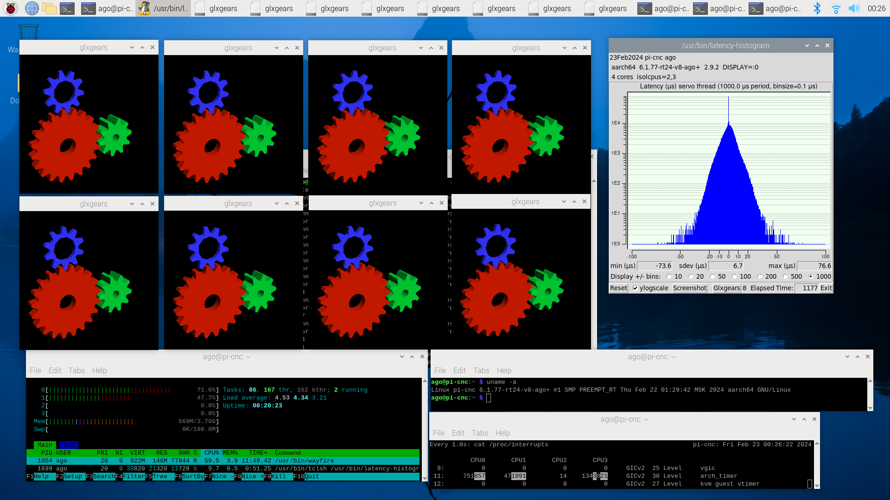

# Preparing Raspberry Pi OS for LinuxCNC

## 0. Does it make sense?

I pretty much pleased to have an alternative with the 'native Debian 12 Bookworm' image for my raspi4 where I don't need do anything at all (see here: https://linuxcnc.org/downloads/).

But I want to check whether I could reach the same performance from a regular Raspberry Pi OS. And it seems I could...

Running
```bash
latency-histogram --nobase --sbins 1000
```
I received maximum jitter value ~80 μs (80,000 ns) with 8 `glxgears` (and it is with out-of-the-box vnc server working over wifi):



Aswering the question 'why?':
\- Because I can :)

## 1. Installing Regular Raspberry Pi OS

Nothing interesting but the regular installation via [Raspberry Pi Imager](https://www.raspberrypi.com/software):
- Raspberry Pi 4
- Raspberry Pi OS (64-bit) 
- SD card (Required at least 5.8 Gb)
- Do OS customization (ssh, wifi, etc...)
- Write the data
- Done

## 2. First Boot
Checking the actual kernel's info:
```bash
uname -a
```
In my case the result is:
```
Linux pi-cnc 6.1.0-rpi7-rpi-v8 #1 SMP PREEMPT Debian 1:6.1.63-1+rpt1 (2023-11-24) aarch64 GNU/Linux
```
Pay attention that the word `PREEMPT` in the line above DOES NOT mean theat you have a realtime kernel!
What we are really would like to see here is the `PREEMPT_RT` word. This is the first goal of further abstracts.

| 💡 BOOST HINT 💡 |
| :--- |
| At this point you can improve the perfomance of further disk operations if you have `USB SSD` drive.
**Note: `USB SSD` ≠ `USB-stick`!** I tried to test my 8Gb USB-stck and found its perfomance even worth than just my `SD Card` (apt update + apt upgrade operations took ~3 hours!). So I suggest to do that only if you have exactly `USB SSD`! 
Clone your `SD Card` using standard Raspberry `SD card copier` (`Accessories > SD Card Copier`) and follow the [instructions](https://www.raspberrypi.com/documentation/computers/raspberry-pi.html#bootloader_update_stable) to update bootloader and change the boot priority. All the disk operations should be faster after booting from `USB SSD`.|

🖥️🐞 First of all fixing the bug 'Session closes after hdmi monitor switches off/on (https://forums.raspberrypi.com/viewtopic.php?p=2175546#p2173369):
```bash
sudo nano /boot/firmware/cmdline.txt
```
add to the end:
```r
vc4.force_hotplug=1
```

Now let's get installed the latest available updates.
```
sudo apt update
sudo apt upgrade
```

## 3. Overclock
| ⚠️ DISCLAIMER ⚠️ |
| :--- |
| This step is not NOT required! It just can slightly decrease the time of further building process.
Please proceed with the [Building a kernel](#4.-Building-a-kernel-with-PREEMPT_RT-patch) if you don't want to risk.
Do this on your risk and only if you are sure.
This overclocking was tested on Raspberry Pi 4b (4Gb) with aluminium radiators (on cpu, gpu, and ram chips) and cooling fan and it works for me. |

Open `config.txt` in any text editor, for example:
```bash
sudo nano /boot/firmware/config.txt
```
and add several lines to the bottom to overclock the CPU from 1500 MHz to 2000 MHz (in theory it is possible to get even 2147 MHz but I stopped at 2000 MHz).
```r
force_turbo=1
over_voltage=5
arm_freq=2000
gpu_freq=700
```
Reboot to apply these changes
```
sudo reboot now
```

## 4. Building a kernel with PREEMPT_RT patch

I have used the following link as the primary actual howto guide:
https://www.raspberrypi.com/documentation/computers/linux_kernel.html#building-the-kernel-locally.

First install Git and the build dependencies:
```bash
sudo apt install git bc bison flex libssl-dev make libncurses5-dev
```
Create the place for playing around
```bash
mkdir ~/kernel
cd ~/kernel
```
Getting the Raspberry OS kernel sources
```bash
git clone --depth=1 --branch rpi-6.1.y https://github.com/raspberrypi/linux
```
Assuming we are in `~/kernel`, the sources will be downloaded to the `~/kernel/linux/`.

Downloading latest RT patch for 6.1
If the URL is outdated you can simply past the parent URL path https://mirrors.edge.kernel.org/pub/linux/kernel/projects/rt/6.1/ to browser and get the actual patch file name. In my case it is `patch-6.1.77-rt24.patch.gz`. 

Downloading (assuming we are in `~/kernel`):
```bash
wget https://mirrors.edge.kernel.org/pub/linux/kernel/projects/rt/6.1/patch-6.1.77-rt24.patch.gz
```
Go to `~/kernel/linux/`
```bash
cd linux/
```
Check the patch (use corresponding name if you changed it above):
```bash
zcat ../patch-6.1.77-rt24.patch.gz | patch -p1 --dry-run
```
Apply the patch:
```
zcat ../patch-6.1.77-rt24.patch.gz | patch -p1
```
Setup environment variable `KERNEL`.
```bash
KERNEL=kernel8
```
NOTE! If you will use another terminal session for further steps please repeat this variable definition before you continue, otherwise you can get unexpected results!

Moving on:
```bash
make bcm2711_defconfig
make menuconfig
```

Go to
- `General setup --->`
    - `Local version - append to kernel release --->`
        - write your kernel suffix here, in my example it's `'-v8-ago'`
    - `Preemption Model --->`
        - choose `'Fully Preemptible Kernel (Real-Time)'`  
        (`PREEMPT_RT=y`)
    -  `Timers subsystem --->`
        - `Timer tick handling --->`
            - enable `'Full dynticks system (tickless)'`  (`CONFIG_NO_HZ_FULL=y`)
    - `RCU Subsystem --->`
        - enable `'Make expert-level adjustments to RCU configuration'`
        - enable `'Offload RCU callback processing from boot-selected CPUs'`  
        (`CONFIG_RCU_NOCB_CPU=y`)
        - enable `'Offload RCU callbacks from realtime kthread'`  
        (`CONFIG_RCU_NOCB_CPU_CB_BOOST=y`)  
        looks like this parameter has the same effect as adding to the cmdline `rcu_nocbs=<isolated cores>` (but I am not sure).

Save and Exit.   
Congrats! You can find updated kernel configuration in `.config` file.

| ❓ WHY RCU AND TIMERS ❓ |
| :--- |
| I have read tons of the instructions before and I found that together with `isolcpus` there very ofthen people suggested to set `rcu_nocbs` and `nohz_full`. Finally I found the description where provided high-level explanation of kernel parameters like `isolcpus`, `rcu_nocbs`, and `nohz_full`: https://www.kernel.org/doc/html/v6.1/admin-guide/kernel-parameters.html. |
| For deep learning:
- https://www.kernel.org/doc/Documentation/RCU/
- https://cateee.net/lkddb/web-lkddb/RCU_NOCB_CPU.html 
- https://cateee.net/lkddb/web-lkddb/RCU_NOCB_CPU_CB_BOOST.html
- https://www.kernel.org/doc/Documentation/timers/NO_HZ.txt |   

So, at this point we have our kernel configuration stored in ```.config``` file.

 Let's build our patched kernel. Internet says that this could take up to 10 hours, but in my case it took ~4 hours.
Fasten your seat belt while seated...
```bash
sudo make -j4 Image.gz modules dtbs
```
After several hours of building... Check that `KERNEL` variable still defined:
```bash
echo $KERNEL
```
if you don't see `kernel8` in the response, just repeat its definition:
```bash
KERNEL=kernel8
```
Make and install the kernel modules:
```
sudo make modules_install
```
Finally we have all we need to replace system files with just built ones
(assuming we are in `~/kernel/linux/`):
```bash
sudo cp arch/arm64/boot/dts/broadcom/*.dtb /boot/firmware/
sudo cp arch/arm64/boot/dts/overlays/*.dtb* /boot/firmware/overlays/
sudo cp arch/arm64/boot/dts/overlays/README /boot/firmware/overlays/
sudo cp /boot/firmware/$KERNEL.img /boot/firmware/$KERNEL-non-rt.img #backup
sudo cp arch/arm64/boot/Image.gz /boot/firmware/$KERNEL.img
```
```bash
sudo reboot
```
Let's check the result:
```
uname -a
```
You should see `PREEMPT_RT` in response now. In my case it is:
```
Linux pi-cnc 6.1.77-rt24-v8-ago+ #1 SMP PREEMPT_RT Thu Feb 22 01:29:42 MSK 2024 aarch64 GNU/Linux
```
We see `PREEMPT_RT` instead of just `PREEMPT`. This is it about the kernel.

Now you may want to add ` isolcpus=2,3 rcu_nocbs=2,3 nohz_full=2,3` to the rest of your `/boot/firmware/cmdline.txt` but I would suggest to wait if you would like also to build the `linuxcnc` from sources. These 2 cores will help us to finish the compilation faster.

## 5. Build and install LinuxCNC 2.9.2 from sources

I have used this https://linuxcnc.org/docs/html/code/building-linuxcnc.html as a primary guide.


Preparing:
```bash
sudo apt install devscripts -y
sudo apt install dpkg-dev -y
```

Build and install LinuxCNC build dependencies:

```bash
cd ~
git clone --depth=1 --branch v2.9.2 https://github.com/linuxcnc/linuxcnc.git ~/linuxcnc-dev
cd linuxcnc-dev
./debian/configure uspace
mk-build-deps
mv linuxcnc-build-deps_$(cat VERSION)_all.deb ../linuxcnc-build-deps_$(cat VERSION)_all.deb
su -c "apt install ../linuxcnc-build-deps_$(cat VERSION)_all.deb -y"
```
Check build dependencies. The result of the command below is the absent dependencies. Empty means OK:
```bash
$ dpkg-checkbuilddeps
```

Build and install LinuxCNC itself:
```bash
$ dpkg-buildpackage -b -uc
su -c "apt install ../linuxcnc-uspace_$(cat VERSION)_$(dpkg --print-architecture).deb -y"
```
As a bonus we have Debian packages in home user directory:
```
ls *.deb
```
We should see the list of prepared packages .
```
linuxcnc-uspace_2.9.2_arm64.deb
linuxcnc-uspace-dev_2.9.2_arm64.deb
linuxcnc-uspace-dbgsym_2.9.2_arm64.deb
linuxcnc-doc-zh-cn_2.9.2_all.deb
linuxcnc-doc-fr_2.9.2_all.deb
linuxcnc-doc-es_2.9.2_all.deb
linuxcnc-doc-en_2.9.2_all.deb
linuxcnc-doc-de_2.9.2_all.deb
linuxcnc-build-deps_2.9.2_all.deb
```
This is it about LinuxCNC itself.

## 6. GPIO driver
Base information https://linuxcnc.org/docs/devel/html/drivers/hal_pi_gpio.html

## 10. LinuxCNC configuration
TBD...

## 7. Mesa flash utility (mesaflash)
Installation:
```bash
sudo apt install mesaflash -y
```

## 8. FPGA RV901T as Mesa 7i90
Hardware and required changes described here:
- https://github.com/q3k/chubby75/tree/master/rv901t
- https://github.com/q3k/chubby75/blob/master/rv901t/doc/hardware.md
- https://github.com/sensille/litehm2
- https://forum.linuxcnc.org/27-driver-boards/47730-new-project-litehm2-a-hostmot2-port-to-linsn-rv901
- https://github.com/trabucayre/openFPGALoader

Installation of openosd
```bash
sudo apt install openocd -y
```

